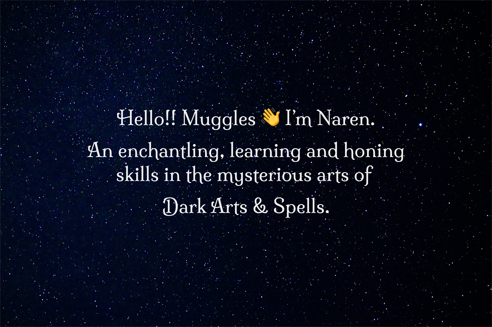

<!--
**Narenpradhan/Narenpradhan** is a ✨ _special_ ✨ repository because its `README.md` (this file) appears on your GitHub profile.

Here are some ideas to get you started:

- 🔭 I’m currently working on ...
- 🌱 I’m currently learning ...
- 👯 I’m looking to collaborate on ...
- 🤔 I’m looking for help with ...
- 💬 Ask me about ...
- 📫 How to reach me: ...
- 😄 Pronouns: ...
- ⚡ Fun fact: ...
-->
 

<h2 align="center">About Me!</h2>

### I am a second-year student pursuing a bachelor's degree in Electronics & Telecommunication Engineering at Veer Surendra Sai University of Technology, Burla. As an aspiring cybersecurity enthusiast, I am currently exploring the fields of Web Application Security and Networking. My deep passion for technology propels my journey of lifelong learning, inspiring me to implement and apply my acquired knowledge in creating projects that contribute meaningfully to the technical community.

 

<h2 align="center">Languages and Tools</h2>

  

 

<h2 align="center">My GitHub Stats</h2>

    

 

    

 

    <!--  -->

